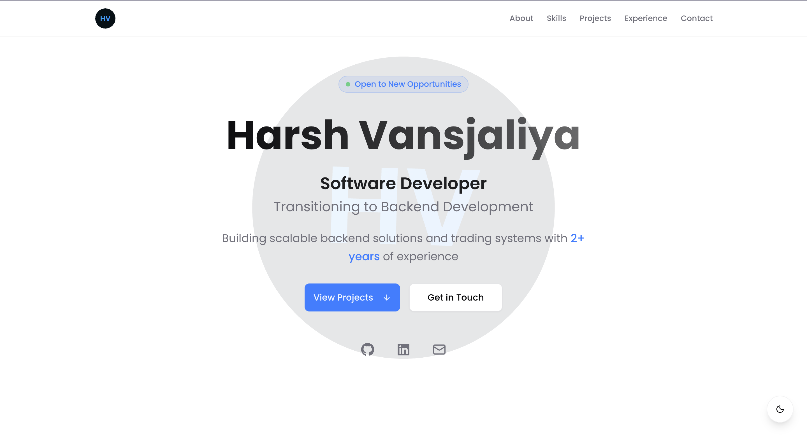

# Harsh Vansjaliya – Portfolio

## About

This is my personal portfolio website built with Next.js, TypeScript, and Tailwind CSS.  
It showcases my projects, skills, and experience as a Software Developer.

## Tech Stack

- Next.js 15 (App Router)
- React 19
- TypeScript
- Tailwind CSS v4
- Framer Motion
- next-themes (Dark Mode)
- Vercel Analytics

## Features

- Dark and Light theme toggle
- Fully responsive design
- SEO optimized with Open Graph and Twitter Cards
- Animated UI with Motion
- Contact form with email integration

## Live Demo

[https://harsh-vansjaliya.vercel.app](https://harsh-vansjaliya.vercel.app)

## Run Locally

```bash
pnpm install
pnpm dev
```

## Screenshots



## Contact

📧 Email: [harshvansjaliya3@gmail.com](mailto:harshvansjaliya3@gmail.com)
🔗 LinkedIn: [https://linkedin.com/in/harsh-vansjaliya-904825226/](https://linkedin.com/in/harsh-vansjaliya-904825226/)
